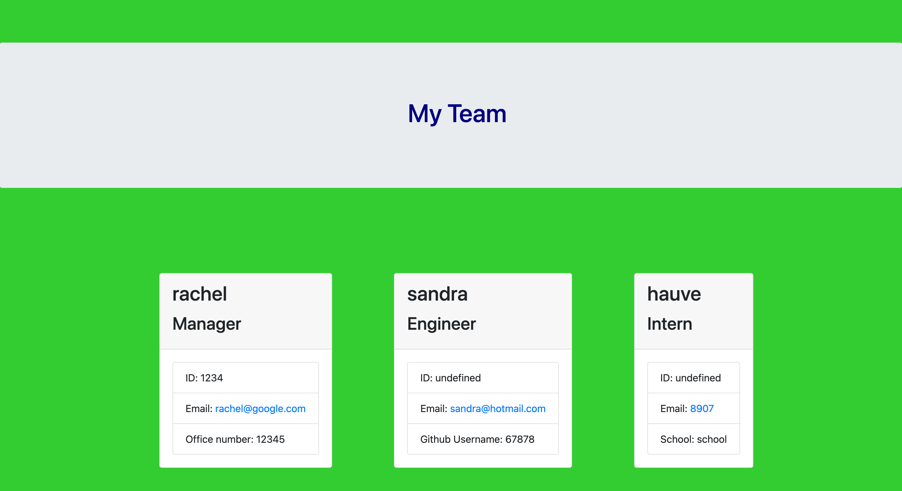

## Team Profile Generator

## Table of contents

1. [Description](#description)
2. [Getting started](#getting-started)
3. [Tests](#tests)
4. [Screenshots](#screenshots)
5. [Link to video](#link-to-video-recording)
6. [User story](#user-story)

## Description

This application creates a webpage which can show data on company employees based on user input. There are three types of roles that can be selected for the company each role is a seperate Javascript class which extends a base employee class.

## Getting started

1. clone the repository
2. run `npm run run start` in a new terminal

## Tests

run `npm run test`

## Screenshots



## Link to video recording

https://drive.google.com/file/d/1gf_Vlixdr5Hy5m29DBuZRkjJ22kJtqnP/view

## User Story

```md
GIVEN a command-line application that accepts user input
WHEN I am prompted for my team members and their information
THEN an HTML file is generated that displays a nicely formatted team roster based on user input
WHEN I click on an email address in the HTML
THEN my default email program opens and populates the TO field of the email with the address
WHEN I click on the GitHub username
THEN that GitHub profile opens in a new tab
WHEN I start the application
THEN I am prompted to enter the team manager’s name, employee ID, email address, and office number
WHEN I enter the team manager’s name, employee ID, email address, and office number
THEN I am presented with a menu with the option to add an engineer or an intern or to finish building my team
WHEN I select the engineer option
THEN I am prompted to enter the engineer’s name, ID, email, and GitHub username, and I am taken back to the menu
WHEN I select the intern option
THEN I am prompted to enter the intern’s name, ID, email, and school, and I am taken back to the menu
WHEN I decide to finish building my team
THEN I exit the application, and the HTML is generated
```
